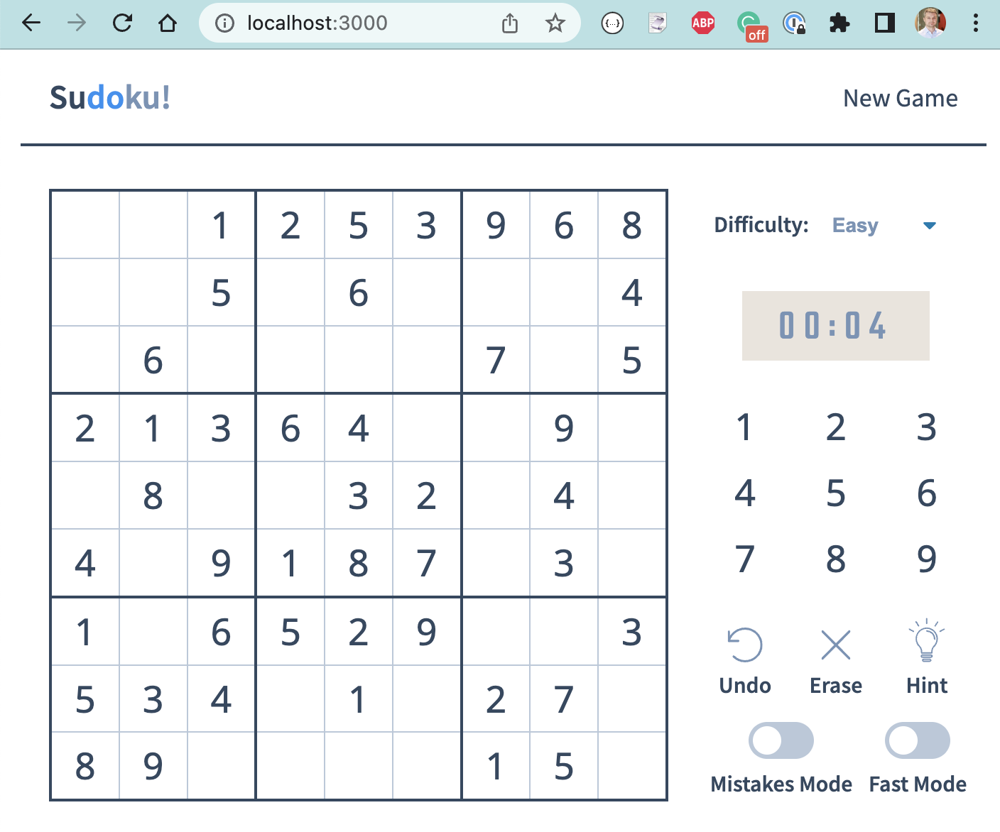

# sudoku-app 

> E2E and React component testing using Cypress v10

Original Sudoku game copied from [https://github.com/raravi/sudoku](https://github.com/raravi/sudoku) and you can play it at [https://sudoku-raravi.vercel.app/](https://sudoku-raravi.vercel.app/).

## Presentation

Here is a typical presentation showing E2E and component testing

- the game working locally
- install
- e2e test at first
- visit the page, check the status, check the cells [loads.cy.js](./cypress/e2e/loads.cy.js)
- check the modes [modes.cy.js](./cypress/e2e/modes.cy.js)
- play the game using the hint [hint.cy.js](./cypress/e2e/hint.cy.js)
- start the component testing
  - Numbers [Numbers.cy.js](./src/components/Numbers.cy.js)
    - CSS
    - pass the click handler
    - show the selected number using provider
- different viewports and screenshots [StatusSection.cy.js](./src/components/layout/StatusSection.cy.js)
- run Cypress tests using GitHub Actions [ci.yml](./.github/workflows/ci.yml)
- maybe timer format unit tests
